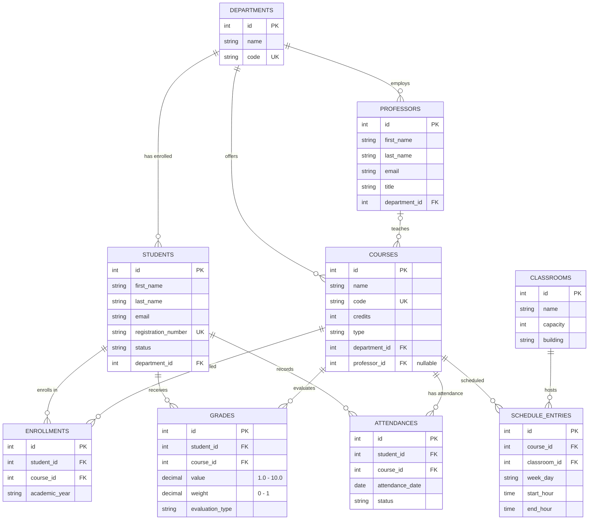

# Academic Catalog - PAOJ 2026 Project

Console application in Java for managing an extended academic catalog:
departments, students, professors, courses, classrooms, enrollments, grades, attendance, and schedules.
Data is persisted in a MySQL database via JDBC.

The project covers **Stage I** (OOP modelling + collections + menu), **Stage II**
(persistence + audit) and **Stage III** (bonus: logging, Streams reports,
CSV/JSON export, and unit tests) from the course requirements.

## Table of Contents

- [Requirements](#requirements)
- [Quick Start](#quick-start)
- [Project Structure](#project-structure)
- [Database Schema](#database-schema)
- [Data Model](#data-model)
- [Application Menu](#application-menu)
- [Usage Examples](#usage-examples)
- [Audit](#audit)
- [Stage III - Bonus Features](#stage-iii---bonus-features)
- [Running the Tests](#running-the-tests)
- [Troubleshooting](#troubleshooting)

## Requirements

- JDK 25
- Maven 3.8+
- Docker / Docker Desktop (for local MySQL)

## Quick Start

1. Start the MySQL container:

```
docker compose up -d
```

The `catalog-mysql` service runs on port **3307** (user `student`, password `student`,
database `catalog`).

2. Compile and run the application:

```
mvn clean compile
mvn exec:java
```

On startup, the schema is created automatically from `src/main/resources/schema.sql` if
the tables do not exist (CREATE TABLE IF NOT EXISTS).

3. To exit, choose option `0` from the menu. To stop the database:

```
docker compose down
```

## Project Structure

```
PAOJ-proiect/
├── docker-compose.yml
├── pom.xml
├── README.md
└── src/
    ├── main/
    │   ├── java/ro/unibuc/catalog/
    │   │   ├── Main.java                  - interactive menu
    │   │   ├── config/                    - properties, JDBC connection, schema init, AppLogger
    │   │   ├── exception/                 - custom exceptions (RuntimeException)
    │   │   ├── model/                     - entities, enums, Printable interface
    │   │   ├── repository/                - DAOs (PreparedStatement, try-with-resources)
    │   │   └── service/                   - business logic, AuditService, ReportService, ExportService
    │   └── resources/
    │       ├── application.properties     - DB connection
    │       ├── logging.properties         - java.util.logging configuration
    │       └── schema.sql                 - DDL for tables
    └── test/java/ro/unibuc/catalog/       - JUnit 5 + Mockito service tests
```

Layers:
- `repository` - direct DB access (SQL + JDBC), no business rules
- `service` - validation, business rules, audit, composes repository calls
- `Main` - reads console input and calls services

## Database Schema

```
departments      (id PK, name, code UNIQUE)
students         (id PK, first_name, last_name, email, registration_number UNIQUE,
                  status, department_id FK -> departments)
professors       (id PK, first_name, last_name, email, title,
                  department_id FK -> departments)
classrooms       (id PK, name, capacity, building)
courses          (id PK, name, code UNIQUE, credits, type,
                  department_id FK -> departments,
                  professor_id FK -> professors  NULL)
enrollments      (id PK, student_id FK, course_id FK, academic_year,
                  UNIQUE (student_id, course_id))
grades           (id PK, student_id FK, course_id FK, value, weight, evaluation_type,
                  CHECK value IN [1.0, 10.0], CHECK weight IN (0, 1])
attendances      (id PK, student_id FK, course_id FK, attendance_date, status)
schedule_entries (id PK, course_id FK, classroom_id FK, week_day, start_hour, end_hour)
```

ON DELETE rules:
- `enrollments`, `grades`, `attendances` -> CASCADE on `student_id` and `course_id`
  (deleting a student/course removes related data)
- `courses.professor_id` -> SET NULL when the professor is deleted

### ER Diagram



Notation: `||--o{` = one-to-many mandatory, `|o--o{` = one (optional)-to-many
(e.g. a course may not yet have an assigned professor).

## Data Model

```
Person (abstract)
  ├── Student      (registrationNumber, status, departmentId)
  └── Professor    (title, departmentId)

Department         (name, code)
Course             (name, code, credits, type, departmentId, professorId?)
Classroom          (name, capacity, building)
Enrollment         (studentId -> courseId, academicYear)
Grade              (studentId, courseId, value, weight, evaluationType)
Attendance         (studentId, courseId, date, status)
ScheduleEntry      (courseId, classroomId, weekDay, startHour, endHour)
```

Enums:
- `StudentStatus`: `ACTIVE`, `GRADUATED`, `SUSPENDED`, `WITHDRAWN`
- `CourseType`: `MANDATORY`, `OPTIONAL`, `ELECTIVE`
- `AttendanceStatus`: `PRESENT`, `ABSENT`, `EXCUSED`
- `WeekDay`: `MONDAY` ... `FRIDAY`

The `Printable` interface (with `printDetails()`) is implemented by all displayable
entity classes (Student, Professor, Department, Course, Classroom, Enrollment, Grade,
Attendance, ScheduleEntry).

Notable business rules (all validated in `service`):
- email must contain `@`
- grade is in `[1.0, 10.0]`, weight in `(0, 1]`
- a student cannot be enrolled in the same course twice (`DuplicateException`)
- attendance is only recorded for students enrolled in that course
- a student with enrollments cannot be deleted (`DeleteNotAllowedException`)
- the end time of a schedule entry must be strictly after the start time

## Application Menu

Options are grouped by entity. The five main entities (Department, Student, Professor,
Course, Classroom) expose all four CRUD operations in the menu; the other entities
(Enrollment, Grade, Attendance, Schedule) have Create + Read + Delete.

```
-- Departments --                     -- Enrollments --
 1. Add department                    21. Enroll student in course
 2. List departments                  22. List enrollments for a course
 3. Rename department                 23. Cancel enrollment
 4. Delete department

-- Students --                        -- Grades --
 5. Add student                       24. Add grade
 6. List students (sorted)            25. List grades for a student
 7. Update student status             26. Compute weighted average
 8. Delete student                    27. Delete grade

-- Professors --                      -- Attendance --
 9. Add professor                     28. Record attendance
10. List professors                   29. List attendance for a course on a date
11. Update professor title            30. Delete attendance
12. Delete professor

-- Courses --                         -- Schedule --
13. Add course                        31. Add schedule entry
14. List courses (sorted)             32. Schedule for a course
15. Assign professor to course        33. Full schedule
16. Delete course                     34. Delete schedule entry

-- Classrooms --                      -- Reports (Streams) --
17. Add classroom                     35. Students by status
18. List classrooms                   36. Courses per department
19. Update classroom capacity         37. Average credits by course type
20. Delete classroom                  38. Courses without a professor
                                      39. Overall grade average
                                      40. Top students by weighted average

                                      -- Export --
                                      41. Export students to CSV
                                      42. Export statistics to JSON

 0. Exit
```

### CRUD Coverage

| Entity      | Create | Read | Update | Delete |
|-------------|:---:|:---:|:---:|:---:|
| Department  | ✅ | ✅ | ✅ rename          | ✅ (if no references) |
| Student     | ✅ | ✅ | ✅ status          | ✅ (if not enrolled) |
| Professor   | ✅ | ✅ | ✅ title           | ✅ (if not teaching) |
| Course      | ✅ | ✅ | ✅ assign prof     | ✅ |
| Classroom   | ✅ | ✅ | ✅ capacity        | ✅ (if not in schedule) |
| Enrollment  | ✅ | ✅ | —                 | ✅ |
| Grade       | ✅ | ✅ | —                 | ✅ |
| Attendance  | ✅ | ✅ | —                 | ✅ |
| Schedule    | ✅ | ✅ | —                 | ✅ |

## Usage Examples

### Scenario 1 - initial setup and enrollment

```
> 1                              # Add department
Department name: Mathematics and Computer Science
Department code: MATE
Created: Department #1 | MATE - Mathematics and Computer Science

> 9                              # Add professor
First name: Ion
Last name: Popescu
Email: ion.popescu@unibuc.ro
Title: conf
Department id: 1
Created: Professor #1 | conf Ion Popescu | ion.popescu@unibuc.ro

> 13                             # Add course
Course name: Advanced Object-Oriented Programming
Course code: PAOJ
Credits: 6
Type: MANDATORY
Department id: 1
Created: Course #1 | PAOJ - Advanced Object-Oriented Programming | 6 credits | MANDATORY | no professor

> 15                             # Assign professor to course
Course id: 1
Professor id: 1
OK.

> 5                              # Add student
First name: Maria
Last name: Ionescu
Email: maria.ionescu@stud.unibuc.ro
Registration number: M2025-0042
Department id: 1
Created: Student #1 | Maria Ionescu (M2025-0042) | maria.ionescu@stud.unibuc.ro | ACTIVE

> 21                             # Enroll student in course
Student id: 1
Course id: 1
Academic year: 2025-2026
Created: Enrollment #1 | student 1 -> course 1 | 2025-2026
```

### Scenario 2 - grades and weighted average

```
> 24                             # Add midterm grade
Student id: 1
Course id: 1
Grade: 9.0
Weight: 0.4
Evaluation type: midterm
Created: Grade #1 | student 1 | course 1 | 9.0 (w=0.4) | midterm

> 24                             # Add final exam grade
Student id: 1
Course id: 1
Grade: 8.0
Weight: 0.6
Evaluation type: final
Created: Grade #2 | student 1 | course 1 | 8.0 (w=0.6) | final

> 26                             # Compute weighted average
Student id: 1
Course id: 1
Average: 8.40
```

### Scenario 3 - schedule

```
> 17                             # Add classroom
Classroom name: A2
Capacity: 80
Building: Pitar Mos
Created: Classroom #1 | Pitar Mos A2 | 80 seats

> 31                             # Add schedule entry
Course id: 1
Classroom id: 1
Day: MONDAY
Start: 10:00
End: 12:00
Created: Schedule #1 | course 1 in classroom 1 | MONDAY 10:00-12:00

> 32                             # Schedule for a course
Course id: 1
Schedule #1 | course 1 in classroom 1 | MONDAY 10:00-12:00
```

### Scenario 4 - intentional validation failures

```
> 21                             # Duplicate enrollment
Student id: 1
Course id: 1
Academic year: 2025-2026
[!] Student is already enrolled in this course

> 8                              # Delete enrolled student
Student id: 1
[!] Student 1 is enrolled in courses and cannot be deleted

> 12                             # Delete professor who is teaching
Professor id: 1
[!] Professor 1 still teaches courses; reassign them first

> 4                              # Delete department with references
Department id: 1
[!] Department 1 still has students, professors or courses attached

> 24                             # Grade out of range
Student id: 1
Course id: 1
Grade: 12
Weight: 1
Evaluation type: bonus
[!] Grade must be between 1.0 and 10.0
```

## Audit

All relevant actions are written to `audit.csv` (in the project root) with an
ISO-8601 timestamp:

```
ADD_DEPARTMENT,2026-04-02T14:23:11
ADD_PROFESSOR,2026-04-02T14:23:47
ADD_COURSE,2026-04-02T14:24:05
ENROLL_STUDENT,2026-04-02T14:25:12
ADD_GRADE,2026-04-02T14:30:08
COMPUTE_AVERAGE,2026-04-02T14:31:22
```

The `audit.csv` file is in `.gitignore` (it is a local artifact).

## Stage III - Bonus Features

Stage III adds four optional features on top of the mandatory stages (the course
requires at least two):

### 1. Logging (`java.util.logging`)

`config/AppLogger` configures the logging subsystem once from
`src/main/resources/logging.properties`. A `FileHandler` appends the full `INFO`
trail to `catalog.log` in the project root, while the console handler is limited
to `WARNING` and above so it does not interfere with the interactive menu.
`catalog.log` is ignored by git (`*.log`).

### 2. Reports with the Streams API

`service/ReportService` computes six in-memory analytics, each built around a
stream pipeline (`groupingBy`, `counting`, `averagingInt`, `filter`, `sorted`,
`mapToDouble`):

| Menu | Report | Stream operation |
|---|---|---|
| 35 | Students by status            | `groupingBy` + `counting` |
| 36 | Courses per department        | `groupingBy(code)` + `counting` |
| 37 | Average credits by course type| `groupingBy` + `averagingInt` |
| 38 | Courses without a professor   | `filter` + `sorted` |
| 39 | Overall grade average         | `mapToDouble` + `average` |
| 40 | Top students by weighted average | `groupingBy` + reduce + `sorted` + `limit` |

### 3. CSV / JSON export

`service/ExportService` serializes reports to the `exports/` directory (ignored
by git):

- **41 - Export students to CSV** -> `exports/students.csv` (RFC 4180 escaping)
- **42 - Export statistics to JSON** -> `exports/statistics.json` (dependency-free
  JSON writer with proper string escaping), containing the overall average,
  student counts by status, courses per department, and the top 5 students.

### 4. Unit tests (JUnit 5 + Mockito)

13 tests under `src/test/java` cover `StudentService`, `GradeService` and
`ReportService` with mocked repositories (no database needed). See
[Running the Tests](#running-the-tests).

### 5. Documentation

This README documents setup, the database schema (with ER diagram), the full
menu, worked examples, and the bonus features.

## Running the Tests

```
mvn test
```

The tests use JUnit Jupiter and Mockito (declared with `test` scope in `pom.xml`)
and run entirely in memory by mocking the repository layer, so a database
connection is **not** required:

```
Tests run: 13, Failures: 0, Errors: 0, Skipped: 0
```

## Troubleshooting

**`Communications link failure` on startup**
The MySQL container is not running or is still initializing. Check:
```
docker compose ps
docker compose logs catalog-mysql
```

**Port 3307 is in use**
Change the mapping in `docker-compose.yml` (`"3308:3306"`) and update
`db.url` in `src/main/resources/application.properties`.

**`mvn` is not recognized**
Add Maven to PATH or run via the IDE wrapper (IntelliJ has a Run Configuration
for `Main.java`).

**Reset the database**
```
docker compose down -v
docker compose up -d
```
The `catalog_data` volume is deleted and the schema is recreated on the next run.
