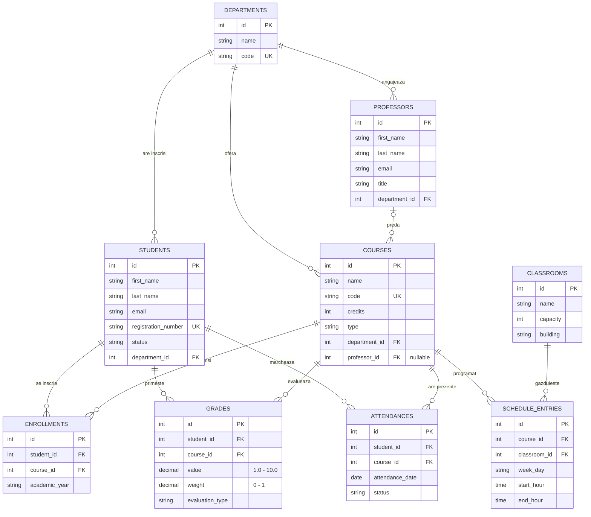

# Catalog academic - proiect PAOJ 2026

Aplicatie de consola in Java pentru gestionarea unui catalog academic extins:
departamente, studenti, profesori, cursuri, sali, inscrieri, note, prezente si orar.
Datele sunt persistate intr-o baza de date MySQL prin JDBC.

Proiectul acopera **Etapa I** (modelare OOP + colectii + meniu) si **Etapa II**
(persistenta + audit) din cerintele cursului.

## Cuprins

- [Cerinte](#cerinte)
- [Pornire rapida](#pornire-rapida)
- [Structura proiectului](#structura-proiectului)
- [Schema bazei de date](#schema-bazei-de-date)
- [Modelul de date](#modelul-de-date)
- [Meniul aplicatiei](#meniul-aplicatiei)
- [Exemple de utilizare](#exemple-de-utilizare)
- [Audit](#audit)
- [Probleme frecvente](#probleme-frecvente)

## Cerinte

- JDK 25
- Maven 3.8+
- Docker / Docker Desktop (pentru MySQL local)

## Pornire rapida

1. Porneste containerul MySQL:

```
docker compose up -d
```

Serviciul `catalog-mysql` ruleaza pe portul **3307** (user `student`, parola `student`,
baza de date `catalog`).

2. Compileaza si ruleaza aplicatia:

```
mvn clean compile
mvn exec:java
```

La pornire, schema este creata automat din `src/main/resources/schema.sql` daca
tabelele nu exista (CREATE TABLE IF NOT EXISTS).

3. La iesire alege optiunea `0` din meniu. Pentru oprirea bazei de date:

```
docker compose down
```

## Structura proiectului

```
PAOJ-proiect/
├── docker-compose.yml
├── pom.xml
├── README.md
└── src/
    └── main/
        ├── java/ro/unibuc/catalog/
        │   ├── Main.java                  - meniu interactiv
        │   ├── config/                    - properties, conexiune JDBC, init schema
        │   ├── exception/                 - exceptii custom (RuntimeException)
        │   ├── model/                     - entitati, enums, interfata Printable
        │   ├── repository/                - DAO-uri (PreparedStatement, try-with-resources)
        │   └── service/                   - business logic + AuditService singleton
        └── resources/
            ├── application.properties     - conexiune BD
            └── schema.sql                 - DDL pentru tabele
```

Layere:
- `repository` - acces direct la BD (SQL + JDBC), fara reguli de business
- `service` - validari, reguli de business, audit, compun apeluri pe repos
- `Main` - citeste input din consola si apeleaza serviciile

## Schema bazei de date

```
departments      (id PK, name, code UNIQUE)
students         (id PK, first_name, last_name, email, registration_number UNIQUE,
                  status, department_id FK -> departments)
professors       (id PK, first_name, last_name, email, title,
                  department_id FK -> departments)
classrooms       (id PK, name, capacity, building)
courses          (id PK, name, code UNIQUE, credits, type,
                  department_id FK -> departments,
                  professor_id FK -> professors  NULL)
enrollments      (id PK, student_id FK, course_id FK, academic_year,
                  UNIQUE (student_id, course_id))
grades           (id PK, student_id FK, course_id FK, value, weight, evaluation_type,
                  CHECK value IN [1.0, 10.0], CHECK weight IN (0, 1])
attendances      (id PK, student_id FK, course_id FK, attendance_date, status)
schedule_entries (id PK, course_id FK, classroom_id FK, week_day, start_hour, end_hour)
```

Reguli ON DELETE:
- `enrollments`, `grades`, `attendances` -> CASCADE pe `student_id` si `course_id`
  (cand stergi un student/curs, datele aferente dispar)
- `courses.professor_id` -> SET NULL daca profesorul e sters

### Diagrama ER



Notatii: `||--o{` = unu-la-multi obligatoriu, `|o--o{` = unu (optional)-la-multi
(de ex. un curs poate sa nu aiba inca un profesor asignat).

## Modelul de date

```
Person (abstract)
  ├── Student      (registrationNumber, status, departmentId)
  └── Professor    (title, departmentId)

Department         (name, code)
Course             (name, code, credits, type, departmentId, professorId?)
Classroom          (name, capacity, building)
Enrollment         (studentId -> courseId, academicYear)
Grade              (studentId, courseId, value, weight, evaluationType)
Attendance        (studentId, courseId, date, status)
ScheduleEntry      (courseId, classroomId, weekDay, startHour, endHour)
```

Enums:
- `StudentStatus`: `ACTIVE`, `GRADUATED`, `SUSPENDED`, `WITHDRAWN`
- `CourseType`: `MANDATORY`, `OPTIONAL`, `ELECTIVE`
- `AttendanceStatus`: `PRESENT`, `ABSENT`, `EXCUSED`
- `WeekDay`: `MONDAY` ... `FRIDAY`

Interfata `Printable` (cu `printDetails()`) e implementata de toate clasele entitate
afisabile (Student, Professor, Department, Course, Classroom, Enrollment, Grade,
Attendance, ScheduleEntry).

Reguli de business notabile (toate validate in `service`):
- email-ul trebuie sa contina `@`
- nota e in `[1.0, 10.0]`, ponderea in `(0, 1]`
- un student nu poate fi inscris de doua ori la acelasi curs (`DuplicateException`)
- prezentele se inregistreaza doar pentru studenti inscrisi la cursul respectiv
- nu poti sterge un student care are inscrieri (`DeleteNotAllowedException`)
- ora de sfarsit a unei intrari in orar trebuie sa fie strict dupa cea de start

## Meniul aplicatiei

Optiunile sunt grupate pe entitati. Cele cinci entitati principale (Departament,
Student, Profesor, Curs, Sala) au toate cele patru operatiuni CRUD expuse in meniu;
celelalte entitati (Inscriere, Nota, Prezenta, Orar) au Create + Read + Delete.

```
-- Departamente --                     -- Inscrieri --
 1. Adauga departament                 21. Inscrie student la curs
 2. Listeaza departamente              22. Listeaza inscrieri pentru un curs
 3. Redenumeste departament            23. Anuleaza inscriere
 4. Sterge departament

-- Studenti --                         -- Note --
 5. Adauga student                     24. Adauga nota
 6. Listeaza studenti (sortat)         25. Listeaza note pentru un student
 7. Schimba statut student             26. Calculeaza media ponderata
 8. Sterge student                     27. Sterge nota

-- Profesori --                        -- Prezente --
 9. Adauga profesor                    28. Inregistreaza prezenta
10. Listeaza profesori                 29. Listeaza prezente la curs intr-o zi
11. Modifica titlu profesor            30. Sterge prezenta
12. Sterge profesor

-- Cursuri --                          -- Orar --
13. Adauga curs                        31. Adauga intrare orar
14. Listeaza cursuri (sortat)          32. Orar pentru un curs
15. Asigneaza profesor la curs         33. Orar complet
16. Sterge curs                        34. Sterge intrare orar

-- Sali --
17. Adauga sala
18. Listeaza sali
19. Modifica capacitate sala
20. Sterge sala

 0. Iesire
```

### Coverage CRUD

| Entitate    | Create | Read | Update | Delete |
|-------------|:---:|:---:|:---:|:---:|
| Department  | ✅ | ✅ | ✅ rename       | ✅ (daca nu are referinte) |
| Student     | ✅ | ✅ | ✅ status       | ✅ (daca nu e inscris) |
| Professor   | ✅ | ✅ | ✅ titlu        | ✅ (daca nu preda) |
| Course      | ✅ | ✅ | ✅ asign prof   | ✅ |
| Classroom   | ✅ | ✅ | ✅ capacitate   | ✅ (daca nu apare in orar) |
| Enrollment  | ✅ | ✅ | —              | ✅ |
| Grade       | ✅ | ✅ | —              | ✅ |
| Attendance  | ✅ | ✅ | —              | ✅ |
| Schedule    | ✅ | ✅ | —              | ✅ |

## Exemple de utilizare

### Scenariu 1 - configurare initiala si inscriere

```
> 1                              # Adauga departament
Nume departament: Matematica si Informatica
Cod departament: MATE
Creat: Department #1 | MATE - Matematica si Informatica

> 9                              # Adauga profesor
Prenume: Ion
Nume: Popescu
Email: ion.popescu@unibuc.ro
Titlu: conf
Id departament: 1
Creat: Professor #1 | conf Ion Popescu | ion.popescu@unibuc.ro

> 13                             # Adauga curs
Nume curs: Programare avansata pe obiecte
Cod curs: PAOJ
Credite: 6
Tip: MANDATORY
Id departament: 1
Creat: Course #1 | PAOJ - Programare avansata pe obiecte | 6 credits | MANDATORY | no professor

> 15                             # Asigneaza profesor la curs
Id curs: 1
Id profesor: 1
OK.

> 5                              # Adauga student
Prenume: Maria
Nume: Ionescu
Email: maria.ionescu@stud.unibuc.ro
Numar matricol: M2025-0042
Id departament: 1
Creat: Student #1 | Maria Ionescu (M2025-0042) | maria.ionescu@stud.unibuc.ro | ACTIVE

> 21                             # Inscrie student la curs
Id student: 1
Id curs: 1
An academic: 2025-2026
Creat: Enrollment #1 | student 1 -> course 1 | 2025-2026
```

### Scenariu 2 - note si medie ponderata

```
> 24                             # Adauga nota partial
Id student: 1
Id curs: 1
Nota: 9.0
Pondere: 0.4
Tip evaluare: midterm
Creat: Grade #1 | student 1 | course 1 | 9.0 (w=0.4) | midterm

> 24                             # Adauga nota examen final
Id student: 1
Id curs: 1
Nota: 8.0
Pondere: 0.6
Tip evaluare: final
Creat: Grade #2 | student 1 | course 1 | 8.0 (w=0.6) | final

> 26                             # Calculeaza media ponderata
Id student: 1
Id curs: 1
Media: 8.40
```

### Scenariu 3 - orar

```
> 17                             # Adauga sala
Nume sala: A2
Capacitate: 80
Cladire: Pitar Mos
Creat: Classroom #1 | Pitar Mos A2 | 80 seats

> 31                             # Adauga intrare orar
Id curs: 1
Id sala: 1
Zi: MONDAY
Start: 10:00
Stop: 12:00
Creat: Schedule #1 | course 1 in classroom 1 | MONDAY 10:00-12:00

> 32                             # Orar pentru un curs
Id curs: 1
Schedule #1 | course 1 in classroom 1 | MONDAY 10:00-12:00
```

### Scenariu 4 - validari care esueaza intentionat

```
> 21                             # Inscriere duplicata
Id student: 1
Id curs: 1
An academic: 2025-2026
[!] Student is already enrolled in this course

> 8                              # Stergere student inscris
Id student: 1
[!] Student 1 is enrolled in courses and cannot be deleted

> 12                             # Stergere profesor care preda
Id profesor: 1
[!] Professor 1 still teaches courses; reassign them first

> 4                              # Stergere departament cu referinte
Id departament: 1
[!] Department 1 still has students, professors or courses attached

> 24                             # Nota in afara intervalului
Id student: 1
Id curs: 1
Nota: 12
Pondere: 1
Tip evaluare: bonus
[!] Grade must be between 1.0 and 10.0
```

## Audit

Toate actiunile relevante sunt scrise in `audit.csv` (in radacina proiectului) cu
timestamp ISO-8601:

```
ADD_DEPARTMENT,2026-04-02T14:23:11
ADD_PROFESSOR,2026-04-02T14:23:47
ADD_COURSE,2026-04-02T14:24:05
ENROLL_STUDENT,2026-04-02T14:25:12
ADD_GRADE,2026-04-02T14:30:08
COMPUTE_AVERAGE,2026-04-02T14:31:22
```

Fisierul `audit.csv` este in `.gitignore` (este artefact local).

## Probleme frecvente

**Eroare `Communications link failure` la pornire**
Containerul MySQL nu e pornit sau inca initializeaza. Verifica:
```
docker compose ps
docker compose logs catalog-mysql
```

**Portul 3307 e ocupat**
Schimba mapping-ul in `docker-compose.yml` (`"3308:3306"`) si actualizeaza
`db.url` in `src/main/resources/application.properties`.

**`mvn` nu este recunoscut**
Adauga Maven in PATH sau ruleaza via wrapper-ul IDE (IntelliJ are Run Configuration
pe `Main.java`).

**Vrei sa resetezi baza de date**
```
docker compose down -v
docker compose up -d
```
Volumul `catalog_data` este sters si schema se recreeaza la prima rulare.
